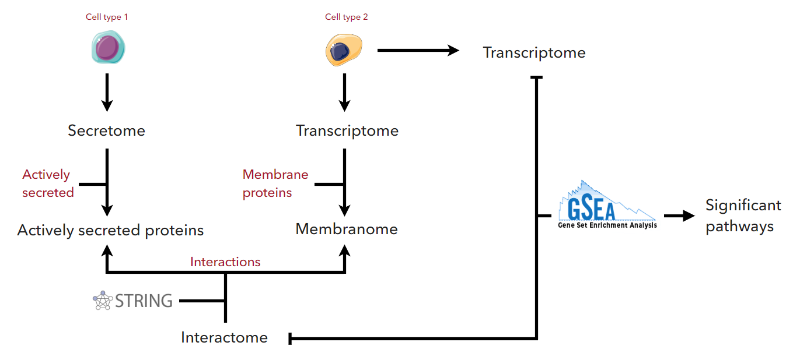

<!-- badges: start -->
[](https://shields.io/)
[](https://www.gnu.org/licenses/gpl-3.0)
<!--badges: end -->
## Multi omics data integration tool
IntOmics is a tool for integrating secretomics and transcriptomics data in order to uncover paracrine cell crosstalk mechanisms.

## Usage
```shell script
java -jar intOmics.jar -p <file> -a <file> -g <file> [options]*
```

## Arguments

| Option                | Description                                                                 |
|:----------------------|:----------------------------------------------------------------------------|
| `-p <file>`           | Text file containing secreted proteins                                      |
| `-a <file>`           | Text file containing all expressed genes                                    |
| `-g <file>`           | Text file containing differentially expressed genes                         |
| `-f <string>`         | Output format: TSV or FWF. Default: TSV                                     |
| `-db <string>`        | Pathway database: [KEGG, WIKIPATHWAYS, REACTOME]. Default: KEGG             |
| `-s <int>`            | Minimum score for PPI (range from 0 to 1000). Default: 900                  |
| `-fc <double>`        | Fold change cutoff. Default: 1.5                                            |
| `-pv <double>`        | P-value cutoff. Default: 0.05                                               |
| `-gpv <double>`       | P-value cutoff for GSEA. Default: 0.05                                      |
| `-t <int>`            | Number of threads to use. Default: 4 or max available if less               |
| `-d <string>`         | Custom separator for input files: Default: ';'                              |
| `--species <string>`  | Species for your data                                                       |
| `--no-cached-sets`    | Pull an up-to-date list of pathways                                         |
| `--ignore-check`      | Ignore checks when pulling updated pathways                                 |
| `--no-cached-ppi`     | Disable usage of cached PPI data                                            |
| `-h`                  | Print the help screen                                                       |

## Input files
Input files should be in CSV format and can have a header line starting with `#`.
The default column separator is `;`, but a different one can be specified using option `-d`.

##### Secreted proteins
Text file containing protein names or corresponding Entrez gene id, each one on a separate line.
##### Expressed genes
Text file containing symbols for all expressed genes, each one on a separate line. This list is used to infer membrane protein-coding genes.
##### Differential expression testing results
Text file in CSV format with three columns: `gene name`, `p value` and `fold change`. 

### Supported species
The tool currently supports four vertebrate species: Human, Mouse, Rat, Cow. 
If you're working with another species please open a new issue, and I'll be sure to address it.

## Outputs
There are two main output files:
* A text file either in TSV or FWF format containing:
    * **Protein**: secreted proteins symbol.
    * **Protein description**: full name of the protein.
    * **Gene**: symbol corresponding to membrane protein-coding gene.
    * **Gene description**: full name of the gene.
    * **I score**: interaction score between the protein and the receptor.
    * **Pathways**: list of pathways with enrichment scores and p-values.

* An HTML file representing the network of interactions between secreted proteins and cell receptors.
    
## Gene set enrichment analysis
The GSEA implemented in this tool is slightly different from the on proposed by Subramanian et al. (2005).

Gene sets are defined as pathways from either `KEGG`, `WIKIPATHWAYS` or `REACTOME`. `KEGG` is chosen by default if option `-db` is not specified. 
This tool has prebuilt `WIKIPATHWAYS` and `KEGG` sets for the human genome, but an up-to-date version can be rebuilt by using option `--no-cached-sets` and stored in `sets/` folder for future use.
Note that if no new pathways exist, the prebuilt version will be used.
This argument though has no effect when using `REACTOME` as no prebuilt sets are available, and the online service is always queried.
 
## Protein-protein interactions
Protein-protein interactions data from StringDB is used to establish a link between secreted proteins and surface receptors.
Interaction scores rank from 0 to 1000, and they do not indicate the strength or the specificity of the interaction.
Instead, they are indicators of confidence. A score of 500 would indicate that roughly every second interaction might be erroneous (i.e., a false positive).

| score              | confidence              |
|:-------------------|:------------------------|
| x > 900            | highest confidence      |
| x > 700            | high confidence         |
| x > 400            | medium confidence       |
| x > 150            | low confidence          |

A cached network of human PPI is used when the interaction score threshold is greater than 700.
You can override this behavior by using option `--no-cached-ppi`.

## Sample data
[Secreted proteins](sample/secreted.csv), [expressed genes](sample/all_genes.csv) and [DE testing results](sample/de_genes.csv)
sample data are provided for testing purpose.
To run the example use the following command:
```shell script
java -jar intOmics.jar -p secreted.csv -a all_genes.csv -g de_genes.csv
```
